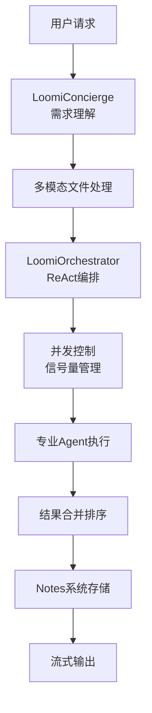

# DeepWiki Q&A with Code Context for Repository: gongfan1213/blueresea


## Q1

这个项目的代码实现了异步多agent调度了吗


### Answer

是的，这个项目确实实现了异步多agent调度。<cite/>

## 异步多agent调度的实现

### 1. Loomi系统的并发调度

在Loomi系统中，`orchestrator.py`实现了真正的异步多agent并发调度： blueresea:1093-1098 

该系统使用信号量控制并发数量，并通过`asyncio.gather`实现真正的并发执行： blueresea:1160-1163 

### 2. Nova3系统的内部并发

Nova3系统在各个agent内部实现了异步并发处理：

- **HitpointAgent**：当检测到多个profile时，进行内部并发处理 blueresea:63-79 ，使用`asyncio.gather`并发执行所有任务 blueresea:104-105 

- **XHSWritingAgent**：支持多个hitpoint的并发处理 blueresea:49-79 

- **WeChatArticleAgent**：同样实现了多hitpoint并发处理 blueresea:49-79 

### 3. 系统架构支持

根据架构分析文档，系统设计为基于队列的智能体编排系统，采用异步架构： blueresea:5-5 

理论并发能力约为20个同时请求，主要受限于LLM API调用： blueresea:625-625 

### 4. LangGraph多agent编排

项目还包含基于LangGraph的多agent编排系统： blueresea:2-4 ，提供了supervisor模式的agent调度： blueresea:58-71 

## Notes

该项目实现了多层次的异步多agent调度：Loomi系统提供orchestrator级别的并发调度，Nova3系统在各个agent内部实现并发处理，同时还有基于LangGraph的图流程编排。这种设计既保证了系统的并发性能，又维持了良好的任务协调和结果整合能力。


### Citations


**File:** agents/loomi/orchestrator.py (L1093-1098)

```python
    async def _execute_parallel_actions(
        self, 
        execute_matches: List[Tuple[str, str]], 
        user_id: str, 
        session_id: str
    ) -> AsyncGenerator[StreamEvent, None]:
```

**File:** agents/loomi/orchestrator.py (L1160-1163)

```python
        async def execute_single_agent_stream(action_type: str, resolved_instruction: str, original_instruction: str):
            """执行单个agent并产生事件流，使用信号量控制并发数量"""
            # 🚀 【并发控制】使用信号量限制同时执行的agent数量
            async with self.agent_semaphore:
```

**File:** agents/nova3/hitpoint_agent.py (L63-79)

```python
        if len(profiles) > 1 and not target_profile:
            self.logger.info(f"HitpointAgent检测到多个profile，进行内部并发处理: {len(profiles)}个profile")
            
            # 为每个profile构建独立的任务
            concurrent_tasks = []
            for i, profile in enumerate(profiles):
                profile_id = profile.get('id', f'profile_{i}')
                self.logger.info(f"准备并发任务 {i+1}/{len(profiles)}: {profile_id}")
                
                # 🔧 DEBUG: 输出原始profile信息
                self.logger.info(f"🔧 DEBUG: 原始profile[{i}] keys: {list(profile.keys())}")
                self.logger.info(f"🔧 DEBUG: 原始profile[{i}]['id']: {profile.get('id', 'NO_ID')}")
                self.logger.info(f"🔧 DEBUG: 原始profile[{i}]内容预览: {str(profile.get('content', ''))[:50]}...")
                
                # 确保profile对象有正确的id字段
                profile_with_id = dict(profile)  # 创建副本避免修改原始数据
                profile_with_id['id'] = profile_id  # 确保id字段正确设置
```

**File:** agents/nova3/hitpoint_agent.py (L104-105)

```python
            # 真正的并发执行所有任务
            results = await asyncio.gather(*concurrent_tasks, return_exceptions=True)
```

**File:** agents/nova3/xhs_writing_agent.py (L49-79)

```python
        # 如果有多个hitpoint且没有指定单个target_hitpoint，进行内部并发处理
        if len(hitpoints) > 1 and not target_hitpoint:
            self.logger.info(f"XHSWritingAgent检测到多个hitpoint，进行内部并发处理: {len(hitpoints)}个hitpoint")
            
            # 为每个hitpoint构建独立的任务
            concurrent_tasks = []
            for i, hitpoint in enumerate(hitpoints):
                hitpoint_id = hitpoint.get('id', f'hitpoint_{i}')
                self.logger.info(f"准备并发任务 {i+1}/{len(hitpoints)}: {hitpoint_id}")
                
                # 为单个hitpoint构建请求数据
                single_hitpoint_request = {
                    **request_data,
                    "target_hitpoint": hitpoint,
                    "nova3_selections": {
                        "nova3_hitpoint": [hitpoint],
                        # 保留其他字段
                        **{k: v for k, v in nova3_selections.items() if k != "nova3_hitpoint"}
                    }
                }
                
                # 创建并发任务
                concurrent_tasks.append(
                    self._collect_single_hitpoint_results(single_hitpoint_request, i+1, len(hitpoints))
                )
            
            self.logger.info(f"开始真正的并发执行 {len(concurrent_tasks)} 个任务...")
            concurrent_start_time = time.time()
            
            # 真正的并发执行所有任务
            results = await asyncio.gather(*concurrent_tasks, return_exceptions=True)
```

**File:** agents/nova3/wechat_article_agent.py (L49-79)

```python
        # 如果有多个hitpoint且没有指定单个target_hitpoint，进行内部并发处理
        if len(hitpoints) > 1 and not target_hitpoint:
            self.logger.info(f"WeChatArticleAgent检测到多个hitpoint，进行内部并发处理: {len(hitpoints)}个hitpoint")
            
            # 为每个hitpoint构建独立的任务
            concurrent_tasks = []
            for i, hitpoint in enumerate(hitpoints):
                hitpoint_id = hitpoint.get('id', f'hitpoint_{i}')
                self.logger.info(f"准备并发任务 {i+1}/{len(hitpoints)}: {hitpoint_id}")
                
                # 为单个hitpoint构建请求数据
                single_hitpoint_request = {
                    **request_data,
                    "target_hitpoint": hitpoint,
                    "nova3_selections": {
                        "nova3_hitpoint": [hitpoint],
                        # 保留其他字段
                        **{k: v for k, v in nova3_selections.items() if k != "nova3_hitpoint"}
                    }
                }
                
                # 创建并发任务
                concurrent_tasks.append(
                    self._collect_single_hitpoint_results(single_hitpoint_request, i+1, len(hitpoints))
                )
            
            self.logger.info(f"开始真正的并发执行 {len(concurrent_tasks)} 个任务...")
            concurrent_start_time = time.time()
            
            # 真正的并发执行所有任务
            results = await asyncio.gather(*concurrent_tasks, return_exceptions=True)
```

**File:** NOVA3_ARCHITECTURE_ANALYSIS.md (L5-5)

```markdown
Nova3是一个基于队列的智能体编排系统，采用异步架构设计，支持多种AI任务的流式处理。本文档详细分析其架构特点、并发能力、风险点和扩容策略。
```

**File:** NOVA3_ARCHITECTURE_ANALYSIS.md (L625-625)

```markdown
Nova3系统当前在单机8核16GB配置下，理论并发能力约为**20个同时请求**，主要受限于LLM API调用。通过优化可提升至**50-100个并发**，分布式部署后可达到**200-500个并发**。
```

**File:** apis/graph_routes.py (L2-4)

```python
LangGraph Multi-Agent 流程接口
基于三阶段 StateGraph 的动态多智能体编排

```

**File:** agents/graph/agent/supervisor_agent.py (L58-71)

```python
supervisor_agent_with_description = create_react_agent(
    model=llm,
    tools=[
        assign_to_research_agent_with_description,
        assign_to_math_agent_with_description,
    ],
    prompt=(
        "You are a supervisor managing two agents:\n"
        "- a research agent. Assign research-related tasks to this assistant\n"
        "- a math agent. Assign math-related tasks to this assistant\n"
        "Assign work to one agent at a time, do not call agents in parallel.\n"
        "Do not do any work yourself."
    ),
    name="supervisor",
```

## Q2

详细分析这loomi系统的架构


### Answer

基于代码分析，Loomi系统是一个基于ReAct模式的智能内容创作系统，采用分层架构设计。<cite/>

## Loomi系统架构概览

Loomi系统采用三层架构：接待层(Concierge)、编排层(Orchestrator)和执行层(专业Agent)。 blueresea:43-75 

## 核心组件分析

### 1. 接待员层 (LoomiConcierge)

LoomiConcierge作为系统前台，负责用户需求理解和任务分发： blueresea:43-75 

主要职责包括：
- 需求理解与分析
- Notes系统管理  
- 上下文与对话管理
- 任务编排与委派
- 用户体验管理

支持多模态文件处理，是整个Loomi系统中唯一的多模态处理入口： blueresea:104-122 

### 2. 编排员层 (LoomiOrchestrator)

LoomiOrchestrator是系统的核心调度引擎，采用ReAct(Reasoning and Acting)模式： blueresea:21-31 

#### 并发控制机制

实现了完善的并发控制系统： blueresea:47-58 

- 使用信号量限制最大并发agent数量为8个
- 支持连接池预热机制
- 提供详细的并发执行统计

#### 连接池管理

具备连接池预热功能，避免连接池耗尽： blueresea:85-106 

#### 输出间隔控制

为避免结果输出过于密集，实现了输出间隔控制机制： blueresea:60-71 

### 3. 专业Agent层

系统包含多个专业化的Agent，每个都继承自BaseLoomiAgent： blueresea:20-31 

#### Agent创建机制

Orchestrator根据action类型动态创建对应的agent实例： blueresea:1691-1727 

支持的专业Agent包括：
- ResonantAgent (共鸣分析)
- PersonaAgent (用户画像)
- KnowledgeAgent (知识管理)
- HitpointAgent (内容打点)
- ContentAnalysisAgent (内容分析)
- BrandAnalysisAgent (品牌分析)
- XHSPostAgent (小红书创作)
- WeChatArticleAgent (公众号文章)
- TikTokScriptAgent (抖音口播稿)
- WebSearchAgent (网络搜索)

### 4. 基础设施层 (BaseLoomiAgent)

所有Loomi Agent都继承自BaseLoomiAgent，提供统一的基础功能： blueresea:21-25 

#### 性能优化配置

集成了全局性能优化配置： blueresea:34-44 

#### 连接池管理

使用分层连接池管理替代直接Redis客户端： blueresea:61-63 

## 会话管理架构

### 会话级Agent管理

系统实现了会话级Agent管理器，避免全局单例导致的会话状态混乱： blueresea:192-207 

每个会话都有独立的agent实例： blueresea:208-220 

### 路由优化

支持直接路由到Orchestrator，跳过Concierge处理： blueresea:659-683 

## 系统流程架构

### 标准处理流程



### 并发执行架构

Orchestrator支持多个action的并发执行，使用asyncio.gather实现真正的并发： blueresea:143-149 

## Notes

Loomi系统的架构设计体现了现代异步编程的最佳实践，通过分层设计、并发控制、连接池管理和会话隔离等机制，实现了高性能的多agent协作系统。系统特别注重用户体验，通过流式输出、思考过程展示和优雅的错误处理，提供了良好的交互体验。


### Citations


**File:** agents/loomi/concierge.py (L43-75)

```python
class LoomiConcierge(BaseLoomiAgent):
    """
    Loomi接待员 - 系统的前台和入口
    
    核心职责：
    1. 🎯 需求理解与分析
       - 接待用户，理解并解析用户的具体需求
       - 识别用户意图（信息查询、任务执行、问题解决等）
       - 判断需求的复杂度和优先级
    
    2. 📝 Notes系统管理
       - 创建和管理用户的知识点Notes
       - 从用户描述中提取关键信息并结构化保存
       - 维护Notes的分类和关联关系
    
    3. 🔄 上下文与对话管理  
       - 维护用户会话的上下文状态
       - 管理多轮对话的连续性
       - 处理用户的追问和补充说明
    
    4. 🎬 任务编排与委派
       - 将复杂需求拆解为可执行的任务指令
       - 调用Orchestrator执行具体的工作流
       - 协调不同Agent之间的协作
    
    5. 🤝 用户体验管理
       - 提供友好的交互界面
       - 处理用户的实时反馈和修正
       - 在任务执行过程中保持与用户的沟通
    
    工作流程：
    用户请求 → 需求理解 → Notes管理 → 任务分析 → 调用Orchestrator → 结果反馈
    """
```

**File:** agents/loomi/concierge.py (L104-122)

```python
    async def process_multimodal_files(
        self, 
        user_id: str, 
        session_id: str, 
        instruction: str
    ) -> List[Dict[str, Any]]:
        """
        🎯 Concierge 专用：处理多模态文件并生成分析结果
        
        这是整个 Loomi 系统中唯一的多模态处理入口。
        会分析文件内容并将结果文本化，供后续 Agent 使用。
        
        Returns:
            List[Dict]: 文件分析结果列表，每个包含 file_ref, analysis_result, file_type 等
        """
        # 使用公共多模态处理器
        analysis_results = await self.multimodal_processor.process_multimodal_files(
            user_id, session_id, instruction, agent_name="concierge"
        )
```

**File:** agents/loomi/orchestrator.py (L21-31)

```python
class LoomiOrchestrator(BaseLoomiAgent):
    """
    Loomi编排员
    
    功能：
    1. 思考决定每一步做什么
    2. 执行具体的action步骤
    3. 管理战术备忘和上下文
    4. 控制ReAct循环
    5. 🚀 并发控制和连接池管理
    """
```

**File:** agents/loomi/orchestrator.py (L47-58)

```python
        # 🚀 【并发控制配置】避免连接池耗尽
        self.max_concurrent_agents = 8  # 限制同时执行的agent数量（从11降到8）
        self.agent_semaphore = asyncio.Semaphore(self.max_concurrent_agents)
        self.connection_prewarming_enabled = True  # 是否启用连接池预热
        
        # 📊 并发执行统计
        self._concurrent_stats = {
            'total_executions': 0,
            'concurrent_peaks': [],
            'connection_wait_times': [],
            'pool_exhaustion_events': 0
        }
```

**File:** agents/loomi/orchestrator.py (L60-71)

```python
        # ⏰ 【结果输出间隔控制】避免结果输出过于密集
        self.output_interval = 10.0  # 10秒间隔
        self.last_output_time = 0  # 记录最后一次输出时间
        self.output_lock = asyncio.Lock()  # 保护输出时间的互斥锁
        self.no_interval_agent_types = {  # 不需要输出间隔控制的agent类型
            'hitpoint',  # hitpoint agent
            'tiktok_script',  # 创作类agent
            'xhs_post',  # 创作类agent  
            'wechat_article',  # 创作类agent
            'revision'  # 创作类agent
        }
        self.logger.info(f"⏰ 输出间隔控制配置: {self.output_interval}s间隔, 排除类型: {self.no_interval_agent_types}")
```

**File:** agents/loomi/orchestrator.py (L85-106)

```python
    async def _prewarm_connection_pools(self, user_id: str, session_id: str):
        """🚀 【连接池预热】在并发执行前预热连接池"""
        if not self.connection_prewarming_enabled:
            return
        
        try:
            # 获取连接池管理器并直接调用预热方法
            pool_manager = await self.get_connection_pool_manager()
            
            # 使用连接池管理器内置的预热功能
            prewarming_result = await pool_manager.prewarm_pools(['high_priority', 'normal'])
            
            if 'error' in prewarming_result:
                self.logger.error(f"❌ 连接池预热失败: {prewarming_result['error']}")
            else:
                success_count = prewarming_result.get('success_count', 0)
                total_count = prewarming_result.get('total_count', 0)
                duration = prewarming_result.get('duration', 0)
                self.logger.info(f"🔥 连接池预热完成: {success_count}/{total_count} 成功, 耗时: {duration:.2f}s")
            
        except Exception as e:
            self.logger.error(f"❌ 连接池预热失败: {e}")
```

**File:** agents/loomi/orchestrator.py (L1691-1727)

```python
    def _create_agent_by_type(self, action_type: str):
        """根据action类型创建对应的agent实例，并继承token accumulator配置"""
        # 🔢 【关键修复】创建agent实例并传递token accumulator key
        agent = None
        
        if action_type == "resonant":
            from .resonant_agent import LoomiResonantAgent
            agent = LoomiResonantAgent()
        elif action_type == "persona":
            from .persona_agent import LoomiPersonaAgent
            agent = LoomiPersonaAgent()
        elif action_type == "knowledge":
            from .knowledge_agent import LoomiKnowledgeAgent
            agent = LoomiKnowledgeAgent()
        elif action_type == "hitpoint":
            from .hitpoint_agent import LoomiHitpointAgent
            agent = LoomiHitpointAgent()
        elif action_type == "content_analysis":
            from .content_analysis_agent import LoomiContentAnalysisAgent
            agent = LoomiContentAnalysisAgent()
        elif action_type == "brand_analysis":
            from .brand_analysis_agent import LoomiBrandAnalysisAgent
            agent = LoomiBrandAnalysisAgent()
        elif action_type == "xhs_post":
            from .xhs_post_agent import LoomiXHSPostAgent
            agent = LoomiXHSPostAgent()
        elif action_type == "wechat_article":
            from .wechat_article_agent import LoomiWeChatArticleAgent
            agent = LoomiWeChatArticleAgent()
        elif action_type == "tiktok_script":
            from .tiktok_script_agent import LoomiTikTokScriptAgent
            agent = LoomiTikTokScriptAgent()
        elif action_type == "websearch":
            from .websearch_agent import LoomiWebSearchAgent
            agent = LoomiWebSearchAgent()
        else:
            raise ValueError(f"未知的action类型: {action_type}")
```

**File:** agents/loomi/__init__.py (L20-31)

```python
# 专业化Agent导入
from .hitpoint_agent import LoomiHitpointAgent
from .persona_agent import LoomiPersonaAgent
from .knowledge_agent import LoomiKnowledgeAgent
from .resonant_agent import LoomiResonantAgent
from .websearch_agent import LoomiWebSearchAgent
from .brand_analysis_agent import LoomiBrandAnalysisAgent
from .content_analysis_agent import LoomiContentAnalysisAgent
from .tiktok_script_agent import LoomiTikTokScriptAgent
from .wechat_article_agent import LoomiWeChatArticleAgent
from .xhs_post_agent import LoomiXHSPostAgent
from .revision_agent import LoomiRevisionAgent
```

**File:** agents/loomi/base_loomi_agent.py (L21-25)

```python
class BaseLoomiAgent(BaseAgent):
    """
    Loomi专用BaseAgent
    集成Notes系统、ReAct模式支持、上下文管理和多模态处理
    """
```

**File:** agents/loomi/base_loomi_agent.py (L34-44)

```python
        # 🚀 【性能优化配置】从全局配置中读取性能设置
        from config.settings import get_settings
        settings = get_settings()
        performance_config = settings.performance_optimization
        
        # 控制是否发送思考过程，提升用户体验
        self.enable_thought_streaming = performance_config.enable_thought_streaming
        self.thought_min_length = performance_config.thought_min_length
        self.thought_batch_size = performance_config.thought_batch_size
        self.enable_fast_mode = performance_config.enable_fast_mode
        
```

**File:** agents/loomi/base_loomi_agent.py (L61-63)

```python
        # 🚀 【优化】使用连接池管理器替代直接Redis客户端
        self.redis_client = None
        self._redis_pool_type = self._determine_redis_pool_type()
```

**File:** apis/routes.py (L192-207)

```python
class SessionAgentManager:
    """
    会话级Agent管理器
    
    解决问题：
    1. 避免全局单例导致的会话状态覆盖
    2. 确保每个会话有独立的agent实例
    3. 防止流式输出混乱到其他会话
    """
    
    def __init__(self):
        self._nova3_agents: Dict[str, Nova3Supervisor] = {}  # session_id -> agent
        self._loomi_agents: Dict[str, LoomiConcierge] = {}    # session_id -> agent
        self._lock = asyncio.Lock()
        self.logger = BluePlanLogger("SessionAgentManager")
    
```

**File:** apis/routes.py (L208-220)

```python
    async def get_nova3_supervisor(self, user_id: str, session_id: str) -> Nova3Supervisor:
        """获取会话专用的Nova3Supervisor实例"""
        async with self._lock:
            session_key = f"{user_id}:{session_id}"
            
            if session_key not in self._nova3_agents:
                # 为这个会话创建新的agent实例
                self._nova3_agents[session_key] = Nova3Supervisor()
                self.logger.info(f"🆕 创建Nova3Supervisor实例: {session_key}")
            else:
                self.logger.debug(f"🔄 复用Nova3Supervisor实例: {session_key}")
            
            return self._nova3_agents[session_key]
```

**File:** apis/routes.py (L659-683)

```python
            # 发送路由优化提示
            route_event = StreamEvent(
                event_type=EventType.SYSTEM,
                agent_source="Loomi",
                payload=EventPayload(content_type=None, data="🎯 检测到用户选择，直接进入任务编排...")
            )
            yield f"{route_event.model_dump_json()}\n\n"
            
            try:
                # 导入并创建Orchestrator
                from agents.loomi.orchestrator import LoomiOrchestrator
                orchestrator = LoomiOrchestrator()
                
                # 构建Orchestrator请求数据
                orchestrator_request = {
                    "query": request.request_data.query,
                    "user_id": request.user_id,
                    "session_id": request.session_id,
                    "background": request.request_data.background or {},
                    "references": request.request_data.references or [],
                    "auto": auto_mode,
                    "user_selections": user_selections,
                    "file_ids": request.request_data.file_ids or [],
                    "source": "direct_routing"  # 标记来源为直接路由
                }
```

**File:** agents/loomi/persona_agent.py (L143-149)

```python
                # 🚀 【关键优化】使用asyncio.gather并发执行所有notes创建
                import asyncio
                try:
                    await asyncio.gather(*note_tasks, return_exceptions=True)
                    notes_end_time = time.time()
                    notes_duration = notes_end_time - notes_start_time
                    self.logger.info(f"✅ 批量并发创建{len(personas)}个notes完成: 耗时{notes_duration:.2f}秒 (单个平均{notes_duration/len(personas):.2f}秒)")
```

