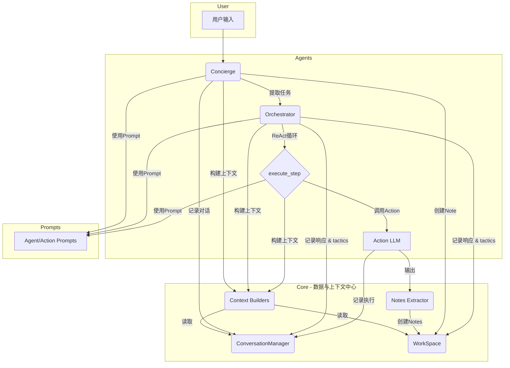

# Loomi 2.0 架构文档

本文档旨在从**上下文架构（Context Architecture）**的视角，解析Loomi 2.0多Agent系统的设计哲学与核心组件。阅读本文档的工程师可以理解系统如何为不同角色的LLM（Concierge, Orchestrator, Action）构建和优化上下文，以实现高效、连贯的任务处理。

## 1. 核心设计哲学：面向上下文的编程

Loomi 2.0 的核心设计思想是**面向上下文的编程（Context-Oriented Programming）**。我们不将Agent视为独立的黑盒，而是将其看作在一个共享、动态的数据环境（`WorkSpace` 和 `ConversationManager`）中协作的**上下文消费者**和**信息生产者**。

系统的关键在于：**在正确的时间，为正确的Agent，提供恰到好处的上下文。**

- **上下文的精确性**：避免信息过载或不足。例如，`Action` Agent的上下文极其精简，只包含指令和引用的Note内容，因为它是一个纯粹的执行者。
- **上下文的分层**：对话历史、任务队列、执行日志被清晰地分离管理，供不同Agent按需取用。
- **上下文的动态性**：上下文不是静态的。`Orchestrator` 的每一次ReAct循环都会消费新的信息（用户新消息、上一步骤的产出），并更新其思考（`tactics`），动态调整下一步行动。

## 2. 系统架构概览

系统主要由三大块构成：**Agents**、**Core** 和 **Prompts**。

### 交互流程简述

1.  **用户 -> Concierge**：`Concierge` (前台)接收用户所有输入。它的主要职责是**理解意图**和**分流任务**。它会利用 `build_concierge_context` 构建一个包含少量聊天历史和所有Notes概览的上下文，以决定是直接回复，还是将一个清晰的任务指令传递给 `Orchestrator`。
2.  **Concierge -> Orchestrator**：一旦确定需要执行复杂任务，`Concierge` 会调用 `Orchestrator` (编排员)，并将任务消息记录到 `ConversationManager` 的任务队列中。
3.  **Orchestrator的ReAct循环**：`Orchestrator` 是系统的核心大脑，采用 **Observe -> Think -> Act** 的模式工作。
    -   **Observe**: 它通过 `build_orchestrator_context` 观察全局状态，包括完整的用户任务队列、自己之前的思考（`tactics`）和所有已创建的 `notes`。
    -   **Think**: 基于观察，LLM进行思考，决定下一步是更新`tactics`，还是执行一个具体的`Action`。
    -   **Act**: 通过调用 `<execute_step>` XML标签来执行动作。
4.  **execute_step -> Action**：`execute_step` 是一个独立的函数，它充当了`Orchestrator`决策和`Action`执行之间的桥梁。它负责：
    -   根据`action`类型选取对应的`prompt`。
    -   调用 `build_action_context` 构建一个**极度精简**的上下文，只包含指令和`@`引用的`note`全文。
    -   调用LLM执行`Action`。
5.  **Action -> Notes**：`Action`的LLM输出一段包含特定XML标签（如`<insight>...</insight>`）的文本。`RobustNotesExtractor` 负责从这些文本中稳健地提取内容，并由 `WorkSpace` 创建为结构化的`notes`。
6.  **循环与完成**：`Orchestrator`看到新生成的`notes`后，再次进入`Observe`阶段，重复循环，直到它认为任务完成，输出`<task_completed/>`。

## 3. 核心模块详解

### 3.1 Agents 模块 (`agents/`)

该模块定义了系统的行为主体。每个Agent的上下文都经过精心设计，以匹配其特定职责，这是“面向上下文编程”思想的核心体现。

#### Concierge (前台)

-   **职责**: 作为系统的交互入口，负责理解用户初步意图，处理简单问答，并在必要时将复杂任务结构化地传递给`Orchestrator`。
-   **上下文 (`build_concierge_context`)**: 其上下文设计旨在实现**快速、轻量级的决策**。它需要广度而非深度。
    -   **`[chat_history]`**: **有限的**近期对话历史。用于理解当前对话的直接语境。
    -   **`[orchestrator_calls]`**: 最近几次`Orchestrator`任务的**摘要**。让`Concierge`知道系统后台正在处理什么，避免信息孤岛。
    -   **`[created_notes]`**: `WorkSpace`中所有`note`的**内容摘要**。使其对当前已有的知识成果有一个高层概览。
-   **特点**: 上下文是**“宽而浅”**的。它能看到各类信息的摘要，但看不到细节，足以做出“继续对话”或“启动任务”的分流决策，而不会被过多信息拖慢响应速度。

#### Orchestrator (编排员)

-   **职责**: 系统的核心大脑，采用ReAct模式进行任务规划、分解和执行。它负责制定和调整高层策略（`tactics`），并调用`Action`来完成具体步骤。
-   **上下文 (`build_orchestrator_context`)**: 其上下文旨在支持**战略性、有状态的思考**。它需要持久和完整的任务视图。
    -   **`[用户消息队列]`**: **完整的**任务相关用户指令历史。确保`Orchestrator`从始至终都明确最初目标及后续所有调整。
    -   **`[tactics]`**: `Orchestrator`自身上一轮的思考备忘。这是实现思维连贯性的关键，使其能够进行迭代式规划。
    -   **`[created_notes]`**: 所有`note`的**内容摘要**。这些是前序步骤的产出，是它进行下一步规划时可以利用的“素材”或“论据”。
-   **特点**: 上下文是**“深而战略性”**的。它掌握完整的任务指令和自己的思考链，同时通过Notes摘要来感知全局进展，专为规划和决策而设计。

#### Action (执行者) - 通过 `execute_step` 函数调用

-   **职责**: 执行由`Orchestrator`下达的原子化、具体的指令（如“写一篇小红书帖子”或“分析用户画像”）。它是一个纯粹的执行单元。
-   **上下文 (`build_action_context`)**: 其上下文是**极度精简和聚焦**的，是上下文优化的最佳体现。
    -   **`[任务指令]`**: 来自`Orchestrator`的一条清晰、无歧义的指令。
    -   **`[引用内容]`**: 指令中通过`@note_id`引用的一个或多个`note`的**完整原文**。
-   **特点**: 上下文是**“窄而深”**的。它只接收执行当前单一任务所需的最少信息，且信息保真度最高（`note`是全文而非摘要）。这种“信息隔离”的设计，可以最大程度避免`Action`的LLM被无关信息（如聊天历史、其他`notes`）干扰，使其能够高度专注于高质量地完成当前指令。

### 3.2 Core 模块 (`core/`)

-   `WorkSpace`:
    -   **职责**：系统的**数据中心**，管理所有结构化数据。
    -   `notes`: 核心数据资产。一个以`note_id`（如`insight1`）为键的字典，存储着类型、内容和来源。它是Agent之间异步通信和知识共享的媒介。`create_note`方法负责自动生成唯一ID。
    -   `tactics`: `Orchestrator`的专属思考空间，是一个简单的字符串，记录了其高层次的计划。

-   `ConversationManager`:
    -   **职责**：系统的**记忆中心**，记录所有交互流水。
    -   `history`: 一个线性的列表，记录了包括`user`, `concierge`, `orchestrator`, `execution`在内的所有事件。
    -   **分层访问**：它提供了`get_recent_chat_history`和`get_recent_orchestrator_calls`等方法，为不同`Context Builder`提供不同视角、不同粒度的历史数据，这是上下文精确性的基础。

-   `Context Builders` (`context_builder.py`):
    -   **职责**：系统的“数据管道工”，为每个Agent量身定制上下文。如上文所述，三个`build_*`函数是本架构的核心，它们精确控制了信息在系统内的流动。

-   `Notes Extractor` (`notes_extractor.py`):
    -   **职责**：从LLM自由生成的文本中，**稳健地**解析出结构化的`note`数据。
    -   `RobustNotesExtractor`: 之所以称之为“Robust”，是因为它考虑了LLM输出XML时可能出现的各种不规范情况（如标签不闭合、数字不匹配等），通过多级匹配（完美、修复、模糊）策略，最大限度地保证数据提取的成功率。

### 3.3 Prompts 模块 (`prompts/`)

-   **职责**：定义每个Agent和Action的**角色、能力和输出格式**。
-   `concierge_prompt.py`: 定义了`Concierge`如何与用户沟通，以及如何使用`<create_note>`和`<call_orchestrator>`工具。
-   `orchestrator_prompt.py`: 定义了`Orchestrator`的ReAct工作循环、上下文结构，以及`<tactics>`, `<execute_step>`, `<task_completed/>`三个核心工具的使用方法。
-   `action_prompts.py`: 一个字典（`ACTION_PROMPTS`），存储了所有`Action`（如`insight`, `profile`, `xhs_post`）的`prompt`。每个`prompt`都清晰地定义了该`Action`的目标、思考框架和必须遵守的XML输出格式。这确保了后续`Notes Extractor`可以顺利工作。

## 4. 总结

Loomi 2.0通过将数据（Core）与行为（Agents）分离，并利用中间的上下文构建层（Context Builders）进行精确的按需连接，实现了一个灵活且强大的多Agent协作框架。这种面向上下文的设计，使得每个Agent都能在信息干扰最小、上下文最相关的环境中工作，从而提升了整个系统输出的质量和连贯性。 
