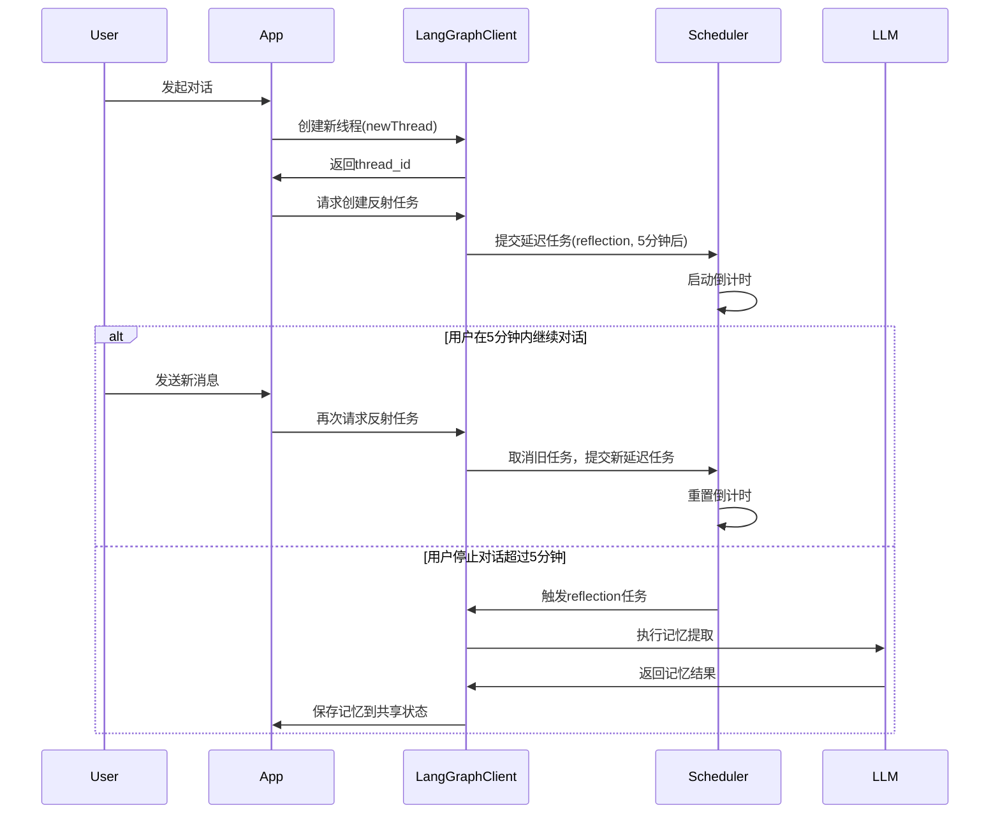

根据代码分析，Open Canvas 的反思机制是一个核心的个性化功能，让我详细解释这个系统的工作原理。

## 反思机制概览

Open Canvas 的反思机制通过分析用户的对话历史和生成的工件来自动生成个性化的记忆和风格指南，这些反思会在后续的交互中被使用以提供更个性化的体验。

## 反思触发机制

反思过程通过 `reflectNode` 在主工作流中被触发。当用户与系统交互并生成或修改工件后，系统会自动启动反思过程： [1](#1-0) 

这个节点创建一个后台运行的反思任务，具有以下特点：
- **延迟执行**：5分钟后才执行，避免频繁的反思生成
- **防抖机制**：如果用户继续活跃对话，会取消之前的反思任务并重新调度
- **后台运行**：不阻塞主要的用户交互流程 [2](#1-1) 

## 反思图的核心逻辑

反思的实际处理在独立的反思图中进行： [3](#1-2) 

反思系统使用 Claude 3.5 Sonnet 模型来分析对话和工件，生成结构化的反思数据。

## 反思数据结构

反思数据包含两个主要类别： [4](#1-3) 

1. **风格规则** (`styleRules`)：用户的写作风格、代码风格、设计偏好等
2. **内容记忆** (`content`)：关于用户的一般记忆、事实和洞察

## 反思提示系统

反思使用精心设计的提示来确保生成高质量的个性化数据： [5](#1-4) 

提示系统强调：
- 基于对话和工件的具体事实生成反思
- 避免重复和低质量的规则
- 保持反思的描述性和详细性
- 区分用户消息和AI生成内容

## 存储机制

反思数据存储在 LangGraph Store 中，使用特定的命名空间结构： [6](#1-5) 

存储和检索通过以下方式进行： [7](#1-6) 

## 反思的使用

生成的反思在后续的交互中被使用，例如在回复一般输入时： [8](#1-7) 

反思数据被格式化并注入到提示中，影响AI的响应风格和内容。

## 前端展示

用户可以通过前端界面查看和管理他们的反思： [9](#1-8) 

界面分别显示风格反思和内容反思，用户可以查看系统对他们的理解。

## 工作流集成

反思节点在主工作流中的位置确保它只在生成或更新工件后触发： [10](#1-9) 

## Notes

Open Canvas 的反思机制是一个智能的个性化系统，通过分析用户行为自动生成记忆，并在后续交互中使用这些记忆来提供更个性化的体验。系统设计考虑了性能（后台运行、防抖）和质量（精心设计的提示、结构化数据），确保反思既准确又有用。

Wiki pages you might want to explore:
- [Frontend Architecture (langchain-ai/open-canvas)](/wiki/langchain-ai/open-canvas#2.1)
### 代码功能详解：异步线程与反射运行机制

这段代码实现了一个基于LangGraph框架的异步反射机制，用于自动提取对话中的关键信息并形成记忆。下面从功能、设计模式和执行流程三个方面进行详细解析。

### 一、核心功能概述

这段代码主要完成两件事：
1. **创建新对话线程**：`langGraphClient.threads.create()`
2. **调度反射任务**：在5分钟后执行"reflection"图计算，提取对话记忆

其核心设计目标是实现对话的**异步记忆形成**，避免影响主对话流程。

### 二、关键参数与设计模式

#### 1. `multitaskStrategy: "enqueue"`
这是一种任务调度策略，具体规则为：
- 当有新任务请求时，不立即执行，而是加入队列
- 如果队列中已有相同类型的待执行任务，则取消旧任务
- 保证同一时间只有一个任务实例存在

**应用场景**：
- 避免重复执行相同任务（如短时间内多次请求记忆提取）
- 节省计算资源（避免不必要的LLM调用）
- 防止生成重复的记忆条目

#### 2. `afterSeconds: 5 * 60`
设置任务延迟执行时间（5分钟），实现了类似"防抖"的功能：
- 当用户持续对话时，不断刷新延迟计时器
- 当用户停止对话5分钟后，自动触发记忆提取
- 平衡了记忆提取的实时性与资源消耗

### 三、执行流程详解

### 四、技术价值与最佳实践

#### 1. 资源优化策略
- **避免重复计算**：通过任务队列和防抖机制，防止用户高频交互时产生大量重复的记忆提取请求
- **延迟执行**：将非紧急任务（如记忆形成）放在低峰期执行，减少对实时对话的性能影响

#### 2. 记忆系统设计
- **共享状态读取**：任务执行时从对话线程读取最新状态，确保记忆提取的完整性
- **自动触发**：无需用户显式请求，系统自动完成记忆形成，提升用户体验

#### 3. 可扩展性
- **参数化配置**：`afterSeconds`和`multitaskStrategy`可根据实际场景调整
- **模块化设计**："reflection"图可独立维护和升级，不影响主对话流程

### 五、潜在风险与优化建议

#### 1. 风险点
- **任务丢失**：如果系统崩溃或重启，队列中的任务可能丢失
- **延迟波动**：在高负载情况下，5分钟的延迟可能无法保证
- **记忆过时**：如果对话持续时间过长，早期内容可能无法及时形成记忆

#### 2. 优化建议
- **持久化任务队列**：将待执行任务保存到数据库，确保系统重启后能恢复
- **动态调整延迟时间**：根据对话长度和活跃度动态调整`afterSeconds`
- **分段记忆提取**：对超长对话进行分段记忆提取，避免信息丢失

### 六、应用场景扩展

这种异步任务调度模式适用于：
- 长对话的自动摘要生成
- 用户行为模式分析
- 知识库自动更新
- 情感分析与情绪追踪

通过调整反射图的实现，可以灵活支持多种后台处理需求。
