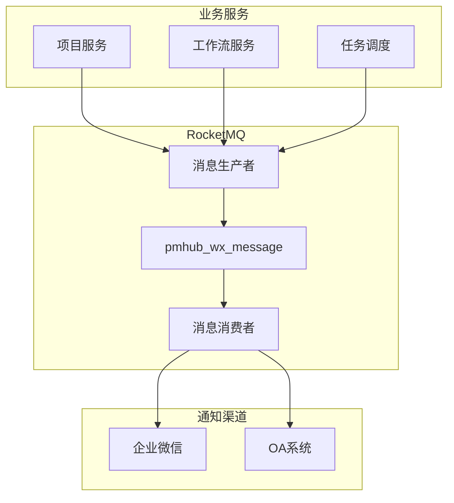

基于 PMHub 项目的代码分析，我来详细讲解 PMHub 如何整合 RocketMQ 实现消息异步解耦。<cite/>

## RocketMQ 在 PMHub 中的整体架构

PMHub 通过 RocketMQ 实现了完整的消息异步解耦架构，主要用于通知系统的消息传递： [1](#9-0) 

## 消息生产者实现

### 1. RocketMQ 工具类

PMHub 封装了 `RocketMqUtils` 工具类来处理消息发送： [2](#9-1) 

核心的消息发送方法 `push2Wx()` 实现了：
- 生成唯一消息ID
- 配置 RocketMQ 客户端
- 设置消息主题和标签
- 发送消息并处理结果

### 2. 消息发送配置

RocketMQ 的配置参数通过配置文件管理： [3](#9-2) 

## 消息消费者实现

### 1. 消息消费者核心逻辑

`OAMessageConsumer` 是消息消费的核心组件： [4](#9-3) 

消费者在应用启动时自动注册监听器，订阅指定的主题和标签。

### 2. 消息类型处理

消费者支持多种消息类型的处理： [5](#9-4) 

支持的消息类型包括：
- 任务审批提醒
- 审批流结束回执
- 待办提醒
- 任务逾期提醒
- 任务已逾期提醒
- 任务指派提醒

### 3. 消息幂等性处理

为了防止重复消费，系统实现了消息幂等性校验： [6](#9-5) 

通过 Redis 存储消息处理状态，确保同一消息不会被重复处理。

## 工作流集成 RocketMQ

### 1. 工作流监听器

工作流系统通过监听器与 RocketMQ 集成： [7](#9-6) 

当任务完成时，监听器会清理相关消息并通过 RocketMQ 发送通知。

### 2. 流程取消处理

流程取消时也会通过 RocketMQ 处理相关消息： [8](#9-7) 

### 3. 业务监听器策略

不同业务类型有专门的监听器执行器： [9](#9-8) 

## Maven 依赖配置

项目中 RocketMQ 的依赖配置： [10](#9-9) 

## 消息清理机制

系统提供了消息清理机制： [11](#9-10) 

当任务完成或流程结束时，会自动清理相关的消息状态。

## 异步解耦的优势

通过 RocketMQ 实现的异步解耦带来了以下优势：

1. **性能提升**：业务操作不需要等待通知发送完成
2. **系统解耦**：业务逻辑与通知逻辑完全分离
3. **可靠性保证**：消息持久化，确保通知不丢失
4. **扩展性强**：可以轻松添加新的消息类型和处理逻辑
5. **故障隔离**：通知系统故障不影响核心业务

## Notes

PMHub 的 RocketMQ 集成展现了企业级消息队列的最佳实践：通过统一的消息生产和消费机制，实现了业务系统与通知系统的完全解耦。消息幂等性处理、多种消息类型支持、以及与工作流系统的深度集成，都体现了系统设计的成熟度。这种架构不仅提高了系统性能，还增强了系统的可维护性和扩展性。

Wiki pages you might want to explore:
- [Core Modules (laigeoffer/pmhub)](/wiki/laigeoffer/pmhub#3)
- [Workflow System (laigeoffer/pmhub)](/wiki/laigeoffer/pmhub#3.2)
- [Notification System (laigeoffer/pmhub)](/wiki/laigeoffer/pmhub#3.3)
