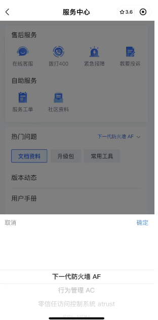
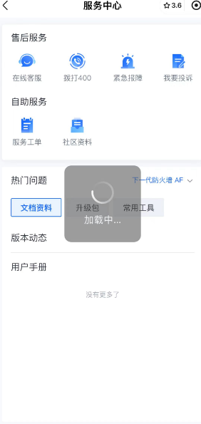
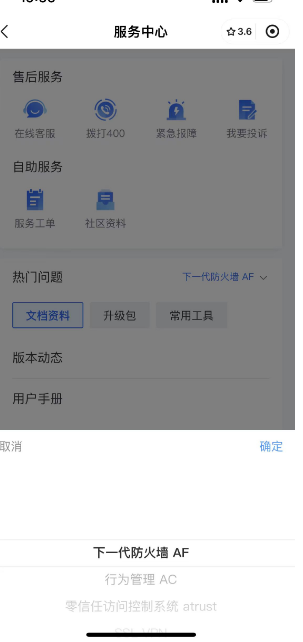

### 云图小程序需求描述



为了提高用户在未登录状态下的使用体验，同时引导用户完成登录或升级账号以解锁更多功能。用户在进入小程序后，可以访问服务中心页面并使用部分功能，但某些功能在未登录状态下会受到限制。
# 我实现了其中的售后服务，自助服务，和热门问题部分

#### 用户故事
1. **未登录用户**：
   - 用户进入云图小程序首页，可以点击进入服务中心页面。
   - 在服务中心页面，可以点击“400紧急保障”并正常使用该功能。
   - 点击其他功能模块时，系统会检查用户登录状态：
     - 如果用户已登录，则根据账号类型进行相应处理：
       - 设备账号：单点登录后正常使用功能。
       - 个人账号：提示账号升级，进入账号升级页面，完成升级后直接单点登录。
       - 暂不升级：进入社区登录页面，输入社区账号密码后正常使用功能。

#### 服务中心功能
服务中心通过 ugrid 展示8个图标，分为售后服务和自助服务两个部分。

1. **售后服务**：
   - 图标：售后服务、在线管理、拨打400、紧急保障、我要投诉。
   - 点击“拨打400”直接拨打电话，点击“紧急保障”正常使用功能。
   
2. **自助服务**：
   - 图标：服务工单、社区资料、维保查询、维修进度。

#### 售后服务页面
- **热门问题**：展示高频问题、文档类、升级包、工具类等内容，并支持根据产品线切换展示对应的问题列表。


# 服务中心能力建设
## 热门问题模块
- u-pick选择对应的产品，cancel,conform,defualt-index:index,item-counter,key-name"label",columns="columns"
- columns对应的id和label还有name,

```bash
get defaultIndex() {
    return [this.columns[0].findIndex(item => item.label === this.productName)]
  }
  cancel() {
  this.isShow=false;
  }
  columns= [
  [{
  id:1,
  label:'下一代防火墙af',
  },
  {id:2,
  label:'下一代防火墙AF2',
  },
  {
  id:3,
  label:''
  },
  
  Confirm(data:{value:ColumnsType[]){
  this.productName=data.value[0].label;
  this.cancel();
  }
```
# tabs切换
scroll-view scroll-with-animation
v-for ="(item,index)inlist " :key="index":class="['item',currentIndex===index?'actie':'']"@click ="handleClick(index,item)"
{{item[keyName]
- 实现了一个水平的滚动的标签栏，允许用户在多个标签之间进行切换，并且在标签切换的时候触发相应的事件
- 在切换标签的时候触发一个自定义的事件，通知父组件当前选中的标签
- 在mounted阶段挂在这个组件
- 获取标签栏的宽度并且初始化标签列表
- 定义了handleChangeList方法，重置选项列表，并且将选中的选项卡索引为1，getScrollLieft计算滚动位置，初始化或者重置选项卡列表，使得第一个选项卡处于选中状态
- 定义了getScrollLeft方法，根据选项卡计算滚动位置

```bash
   getScrollLeft(index: number) {
     const query = uni.createSelectorQuery().in(this);
     query
       .selectAll('.item')
       .boundingClientRect((res: SafeAny) => {
         let totalWidth = 0;
         for (let i = 0; i < this.currentIndex; i++) {
           totalWidth += res[i].width + 8;
         }
         const clickedTabCenter = totalWidth + res?.[index]?.width / 2;
         const newLeft = clickedTabCenter - this.tabsWidth / 2;
         this.scrollLeft = newLeft;
       })
       .exec();
   }

```
在选项卡被点击或者初始化的时候，计算并且设置滚动的位置
根据选项卡被点击或者初始化，计算并且设置滚动位置
createSelectorQuery获取当前组件的选择器查询实力
查询鄋的item的信息
计算总的宽度，选项卡的宽度和8px的宽度，确定选中的选项卡的中心位置，计算新的滚动位置让选项卡居中显示
在组件挂在的时候，重置选项卡列表并且计算初始化滚动的位置，处理选项卡点击事件，更新选中的状态并且计算新的滚动位置，

# 定义不同的类型枚举
```js
export const enum overviewTypeEnum {
''='',
''='',
''='',
}

```

定义对应的售后服务映射
```js
export const AfterServiceMap = [
{type:,
title:'',
url:'',
},
{type:'title:''url'',},
{\}
```

- 对应的图片，title标题和服务的类型，
- 定义自助服务枚举
```js
export const SelServiceMap = [
type:overviewTypeEnum.workOrder,
title:'',
url:''
},
{type:,
title:'',
url:''}

```

# 封装overview组件u-grid定义对应的网格布局的服务向列表
- 用户点击网格的每一个服务触发对应的事件
- u-grid,image,text,grid-item，显示对应的售后服务选项和自助服务选项

- 默认处理方法，弹窗：showToast,拨打服务,makePhoneCall,页面跳转:handleNavigateTo
- 处理网格的点击事件：
handleGridClick switch case处理对应的点击事件
#### 登录功能
- 用户在界面上输入用户名、密码或通过手机号进行登录。

1. **表单验证**：
   - 在用户点击登录按钮时，前端会对输入的信息进行验证，确保信息的完整性和正确性。

2. **发送请求**：
   - 前端将用户输入的信息发送到后端服务器进行验证，通过调用API接口实现。

3. **处理响应**：
   - 根据后端返回的响应结果，前端进行相应的处理：
     - 登录成功：跳转到主页或双因素验证页面。
     - 登录失败：显示错误信息，并根据错误码进行不同的处理，如密码过期、需要验证码等。

# 表单验证
- 用户点击登录按钮，前端会对输入信息进行验证：getdisabledLogin方法
# 登录：
- 组件初始化，data当中定义了多个变量，名字，密码，管理员名字，管理员id,isLoginging,errorMsg,存储用户输入和状态信息
- onload:
- 有重定向页面的参数，保存
- onShow页面显示，刷新cookie获取登录状态
- 检查当前是否正在执行登录的操作，如果是直接返回，避免重复登录请求
- readlocalUserProfile读取本地的信息，
- 检查是否正在登录，如果是则直接返回，获取用户信息，如果没有则调用getUserProfille方法获取
- 显示加载中
- 调用登录api,传递用户等参数
- 如果登录成功，保存登录信息，并且根据返回的数据决定是否跳转到双因素验证页面或者直接登录

- 如果验证是否，根据不同的错误码处理，密码过期，需要验证码等等
- 调用完api登录以后，根据后端的相应结果进行对应的处理
- 登录成功
- setLoginInfo保存登录信息
- redirect_page=this.redirectPage;
- navigateTo跳转到双因素验证页面或者直接登录
- url拼接
- 登录失败：
- 密码过期，跳转到修改密码页面
- 需要密码或者需要重置密码，跳转到初始登录页面，需要验证码，cookie过期，刷新cookie并且重新登录
- 跳过验证，直接授权登录
## 总结登录流程
- 检查是否正在登录，避免重复请求
- 2.获取用户的信息，从本地存储或者服务器获取用户信息
- 3.显示加载中信息，在进行登录请求的时候显示加载提示
- 4.发送登录请求，调用登录api,讲用户输入的信息发送到服务器进行验证
- 5.处理响应结果，登录成功，保存登录信息，跳转到对应的页面
- 登录失败，根据不同的错误码进行处理，显示验证，刷新cookie等等
- 隐藏加载中提示：在登录完成后隐藏加载的提示，并且处理错误的提示信息

## 原本已有的：
- 定义自定义导航栏组件，显示导航栏和处理返回操作，处理多个冲突账号选择
- 自定义输入框，切换主账号和子账号的方式
- 冲突账号组件，处理多个冲突账号渲染
